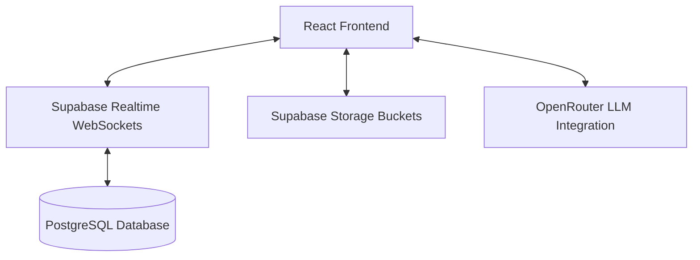

# TourWeave

TourWeave is a collaborative itinerary planning application featuring real-time synchronization, group expense management with OCR receipt parsing, travel journaling, and AI-driven travel insights.

---

### 🎓 Academic Project
* **Institution:** [Insert University/College Name]
* **Department:** Department of Computer Science & Engineering
* **Authors:** [Insert Team Members]
* **Advisor:** [Insert Project Advisor]

---

## 🚀 Core Features

* **Real-Time Collaborative Itineraries**: Plan routes and stops collectively. Changes synchronize instantly across all members using WebSockets.
  * *Pointers:* [TripDetail.jsx](file:///c:/Users/dell/Desktop/tourweave/src/components/TripDetail.jsx) & [itineraryService.js](file:///c:/Users/dell/Desktop/tourweave/src/services/user/itineraryService.js)
* **Expense Management & Settlement**: Add group expenses and calculate settlements. Supports Equal, Exact, Percentage, and Share-based splits, and simplifies debts to minimize transactions.
  * *Pointers:* [expenseSplitLogic.js](file:///c:/Users/dell/Desktop/tourweave/src/utils/expenseSplitLogic.js) & [BalancesSettlementCard.jsx](file:///c:/Users/dell/Desktop/tourweave/src/components/expense/BalancesSettlementCard.jsx)
* **Receipt OCR Parsing**: Extract expense details directly from receipt images using client-side character recognition.
  * *Pointers:* [ExpenseManagerCard.jsx](file:///c:/Users/dell/Desktop/tourweave/src/components/expense/ExpenseManagerCard.jsx#L164)
* **Travel DNA & Sentiment Analytics**: Log travel memories and perform sentiment analysis on entries. Combines travel history and preferences to suggest travel styles using AI model completions.
  * *Pointers:* [patternAnalysisService.js](file:///c:/Users/dell/Desktop/tourweave/src/services/ai/patternAnalysisService.js) & [PatternDashboard.jsx](file:///c:/Users/dell/Desktop/tourweave/src/components/PatternDashboard.jsx)
* **Interactive Mapping**: Plan trips visually with interactive map overlays representing states and regions.
  * *Pointers:* [IndiaMap.jsx](file:///c:/Users/dell/Desktop/tourweave/src/components/IndiaMap.jsx) & [StatePlanner.jsx](file:///c:/Users/dell/Desktop/tourweave/src/components/StatePlanner.jsx)
* **AI Travel Companion**: Chat with an integrated travel copilot to get destination recommendations and local travel tips.
  * *Pointers:* [ChatCopilot.jsx](file:///c:/Users/dell/Desktop/tourweave/src/components/ChatCopilot.jsx)

---

## 🏗️ System Architecture

The application uses a serverless decoupled architecture: **React (Vite)** on the frontend, **Supabase** for user authentication, real-time database updates, and file storage, and **OpenRouter** for language model capabilities.



---

## 📊 Database Schema Overview

| Table | Description | Key Relationships |
|---|---|---|
| `profiles` | User profile data linked to authentication | `id` (references auth.users) |
| `trips` | Trip metadata (destination, start/end dates) | `created_by` (references auth.users) |
| `trip_members` | Junction table for trip collaborators and roles | `(trip_id, user_id)` |
| `itinerary_items` | Individual itinerary stops on a trip | `trip_id` (references trips.id) |
| `groups` | Ledgers containing expense participants | `owner_user_id` (for RLS) |
| `participants` | Members in an expense group ledger | `group_id` (references groups.id) |
| `expenses` | Logged group expense details | `group_id` (references groups.id) |
| `expense_splits` | Breakdowns of amount owed per participant | `expense_id` (references expenses.id) |
| `travel_journal_entries` | Mood journals and memory entries | `user_id` (references auth.users) |
| `travel_dna` | Travel preference indicators and AI personality reports | `user_id` (references auth.users) |

---

## 🛠️ Local Setup

### 1. Installation
Clone the repository and install dependencies:
```bash
npm install
```

### 2. Environment Configuration
Create a `.env` file in the root folder:
```env
VITE_SUPABASE_URL=https://your-project.supabase.co
VITE_SUPABASE_ANON_KEY=your-supabase-anon-key
VITE_OPENROUTER_API_KEY=your-openrouter-api-key
```

### 3. Database Migration
Apply the database schemas and RLS configurations by executing the migration scripts in the Supabase SQL editor in this order:
1. [supabase_schema.sql](file:///c:/Users/dell/Desktop/tourweave/supabase/migrations/supabase_schema.sql)
2. [supabase_migration_rbac.sql](file:///c:/Users/dell/Desktop/tourweave/supabase/migrations/supabase_migration_rbac.sql)
3. [supabase_migration_trips.sql](file:///c:/Users/dell/Desktop/tourweave/supabase/migrations/supabase_migration_trips.sql)
4. [supabase_migration_itinerary.sql](file:///c:/Users/dell/Desktop/tourweave/supabase/migrations/supabase_migration_itinerary.sql)
5. [supabase_migration_expense_names.sql](file:///c:/Users/dell/Desktop/tourweave/supabase/migrations/supabase_migration_expense_names.sql)
6. [supabase_migration_journal.sql](file:///c:/Users/dell/Desktop/tourweave/supabase/migrations/supabase_migration_journal.sql)
7. [supabase_migration_dna.sql](file:///c:/Users/dell/Desktop/tourweave/supabase/migrations/supabase_migration_dna.sql)
8. [supabase_migration_dna_history.sql](file:///c:/Users/dell/Desktop/tourweave/supabase/migrations/supabase_migration_dna_history.sql)
9. [supabase_migration_chat.sql](file:///c:/Users/dell/Desktop/tourweave/supabase/migrations/supabase_migration_chat.sql)

### 4. Running the App
Start the Vite local development server:
```bash
npm run dev
```
Open [http://localhost:5173](http://localhost:5173) in your browser.

---

## 🔮 Future Enhancements
* **Offline Synchronization**: Local storage support to buffer plan changes and sync on network reconnection.
* **Currency Conversion**: Automated conversions using live exchange rate APIs.
* **Smart Route Suggestion**: Algorithmic suggestion of optimal visitation sequences between itinerary stops.
